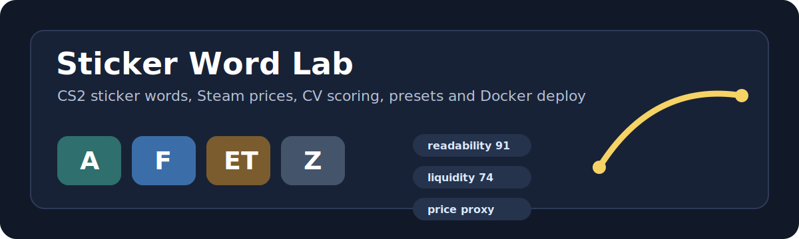

# Sticker Word Lab

<p align="center">
  
</p>


Веб-прототип для подбора CS2-стикеров под слово или ник: генератор крафтов, Steam price proxy, CV-оценка читаемости, пресеты, короткие ссылки и money/revenue cockpit.

## Деплой на сервер

Docker/VPS инструкция: [`docs/deploy-vps.md`](docs/deploy-vps.md).

```bash
DOMAIN=craft.example.com bash scripts/deploy.sh
```

Тестовый кейс по умолчанию: `afetz`.

## Что сделано

- Загружается полный список стикеров из ByMykel CSGO-API: `public/api/en/stickers.json`.
- База кешируется в `localStorage` на 12 часов, чтобы приложение не зависело от повторного API-запроса при каждом открытии.
- Слово нормализуется в латиницу, поэтому `афетз` превращается в `afetz`.
- Генератор разбивает слово на фрагменты до 4 символов и ищет совпадения в названиях команд, логотипов и автографов.
- В блоке "Лучшие замены" можно кликнуть по любому кандидату, и он заменит соответствующий стикер в верхнем крафте.
- Добавлен client-side Computer Vision слой: PNG читаются через CORS-safe image proxy и оцениваются по alpha-mask, bounding box, плотности, контрасту и балансу.
- Добавлен local backend: серверный кеш базы, Steam priceoverview proxy, server-side PNG CV и короткие ссылки на общие пресеты.
- Добавлен Money Lab: стоимость крафта, readability, liquidity, resale edge, scrape risk, арбитражные замены и copyable sell pitch.
- Добавлен Craft Desk: pricing cards, lead capture, checkout endpoint, поддержка Stripe Payment Links и Stripe Checkout Sessions.
- Пресеты можно копировать, сохранять локально и восстанавливать; экспорт содержит `token`, `visible`, `stickerId`, `scrape`, `angle` и Steam Market URL.
- У каждого выбранного и найденного стикера есть ссылка на Steam Market.
- Для `afetz` добавлен калиброванный рецепт со скриншота:
  - `A` = Apeks Copenhagen 2024, scrape 0%.
  - `F` = FaZe Clan Paris 2023, scrape 0%.
  - `ET` = BnTeT Berlin 2019, scrape 30%.
  - `Z` = zont1x Shanghai 2024, scrape 64%.

## Ресерч

- [ByMykel/CSGO-API](https://bymykel.com/CSGO-API/) дает неофициальный JSON API для CS2, включая список stickers, изображения, type, effect и tournament.
- [CS.MONEY](https://cs.money/blog/cs-go-skins/all-stickers-with-letters-in-cs2-stickers-to-form-words/) ведет алфавит стикеров и отдельно отмечает, что слова можно собирать из team logos, letter combos и player autographs.
- [Steam Community guide](https://steamcommunity.com/sharedfiles/filedetails/?id=3099174230) собирает letter-craft подходы и ссылается на CS Sticker / CSInspect как на похожие инструменты.
- [Profilerr](https://profilerr.net/how-to-make-a-nickname-on-weapon-with-stickers-in-cs2/) описывает workflow с поиском букв, canvas-проверкой, overlap и CSInspect.
- [cryck/sticker-composer](https://github.com/cryck/sticker-composer) полезен как референс по selected-stickers UI и paging вариантов.
- [Tamada4a/cs2-sticker-words](https://github.com/Tamada4a/cs2-sticker-words) полезен как референс по фильтрам unusual stickers и лимиту количества стикеров.
- CSInspect и CS2Inspects полезны как референсы по placement/preview, но точную задачу scrape-процентов под конкретные перекрытия они не закрывают полностью.
- Продуктовая ниша для монетизации: существующие инструменты хорошо решают генерацию, preview или поиск по Steam, но слабее связывают крафт с ценой, ликвидностью, риском scrape и готовым текстом продажи.

## Как запустить

Открой `index.html` в браузере или запусти локальный сервер:

```powershell
python -m http.server 5173
```

После этого сайт будет доступен на `http://localhost:5173`.

Для режима с бекендом:

```powershell
python backend/server.py --port 8000
```

Открой `http://127.0.0.1:8000`. Если фронт запущен отдельно на `localhost:5173`, он тоже автоматически найдёт бекенд на `127.0.0.1:8000`.

## Backend: что он решает и что пока ограничивает

- Решает CORS для PNG-анализа: браузеру больше не нужен внешний image proxy.
- Даёт общий серверный кеш базы стикеров и Steam-цен, чтобы не долбить внешние API при каждом открытии.
- Сохраняет пресеты на сервере и отдаёт короткую ссылку `/p/{id}`.
- Steam priceoverview остаётся неофициальным публичным endpoint: возможны rate limits, пустые цены и задержки, поэтому кеш обязателен.
- CV пока эвристический: он оценивает форму/плотность/контраст PNG, но это ещё не настоящий OCR, который точно понимает буквы.
- Пресеты сейчас лежат на диске в `backend/data`; на бесплатном хостинге нужна persistent storage или маленькая БД, иначе данные могут пропасть при redeploy/sleep.
- Перед публичным хостингом нужно настроить HTTPS/CORS под домен, rate limits, логи и бэкап кеша/пресетов.

## Монетизация

- `GET /api/monetization` отдаёт публичные планы и ссылки оплаты.
- `POST /api/leads` сохраняет заявки в `backend/data/leads/leads.jsonl`.
- `POST /api/checkout` создаёт Stripe Checkout Session, если заданы `STRIPE_SECRET_KEY` и `stripe_price_id`; иначе использует `payment_url`.
- `GET /api/admin/revenue` считает EBITDA cockpit: лиды, pipeline, affiliate clicks, COGS, fees, fixed cost и EBITDA margin.
- `/out/{affiliate_id}` трекает партнёрские переходы перед редиректом.
- Реальные деньги начнут приходить только после подключения твоих платёжных ссылок или Stripe secret key. Инструкция: `docs/revenue-setup.md`.

## План развития

1. Вынести backend на бесплатный хостинг с persistent storage и HTTPS.
2. Расширить CV до настоящего OCR/segmentation-моделя на сервере, чтобы определять конкретные буквы в логотипе.
3. Собирать scrape-кривые для популярных стикеров: до/после каждого уровня стирания.
4. Добавить экспорт в формат placement-инструментов вроде CSInspect, если будет стабильная публичная схема URL/API.
5. Добавить ручные placement-слайдеры по X/Y/scale/rotation для проверки перекрытий как в inspect-инструментах.
